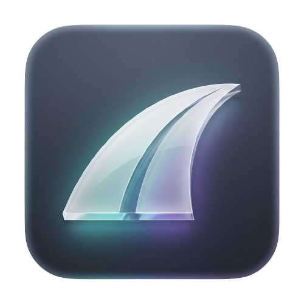

# Highway To-Do

A beautiful, minimalist To-Do list application for macOS that lives directly in your menu bar.

## Features

- **Menu Bar Integration**: Quick access to your tasks without leaving your workflow.
- **Premium Aesthetics**: Vibrant liquid gradients and frosted glass (ultra-thin material) UI.
- **Task Management**: Easily add, complete, and delete tasks.
- **Prioritization**: Set High, Medium, or Low priority for your tasks.
- **Localization**: Multi-language support (English, Russian, Greek).
- **Settings**: Customizable preferences for your experience.

## Technology Stack

- **Language**: Swift
- **Framework**: SwiftUI
- **Platform**: macOS (built with AppKit integration for MenuBarExtra)

## How to Run

1. Clone the repository.
2. Open the project folder.
3. Use the provided `build.sh` script or open in Xcode (if project file is generated).
4. Run the application!

## License

This project is licensed under the MIT License.
